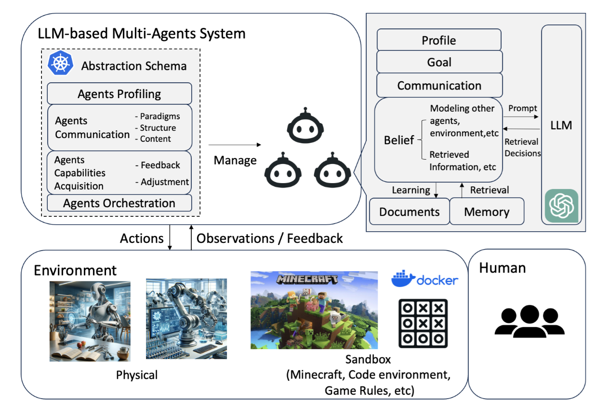
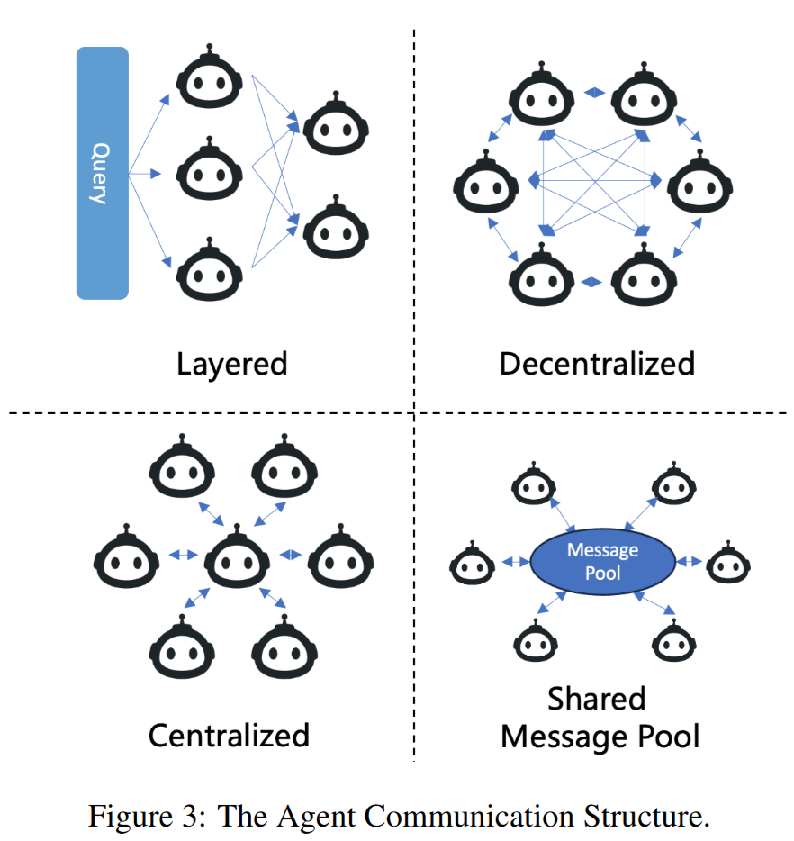

## Fundamentals of Multi-Agent Systems

A Multi-Agent System (MAS) is a collection of two or more autonomous agents that interact within some environment. At its core, a multi-agent system consists of multiple interacting intelligent agents that each can act independently but also collaborate to achieve a common goal or solve complex problems together (https://www.catio.tech/blog/multi-agent-systems-fundamentals---a-personal-experience#:~:text=,to%20fulfill%20their%20designed%20objectives). Each agent in a MAS has its own knowledge or perspective, and they exchange information or coordinate actions as needed. Classic examples include robot teams, distributed problem-solving networks, or agent-based simulations of economies or ecologies.

Multi-agent systems have several key characteristics (https://www.catio.tech/blog/multi-agent-systems-fundamentals---a-personal-experience#:~:text=Introduction%20to%20Multi):

- Autonomy: Each agent operates without direct human control, making its own decisions based on its observations and objectives.

- Social Ability: Agents can interact with other agents (e.g. by sending messages). Communication enables coordination and cooperation.

- Reactivity: Agents perceive their environment (which may include other agents) and respond to changes in a timely manner. 

- Proactiveness: Agents don’t just react; they can take initiative to fulfill their goals (goal-driven behavior).

In summary, MAS research provides principles for how agents can coordinate, negotiate, and work together (or in some cases, compete) effectively. The field has decades of history in distributed AI and includes theories of cooperation, communication protocols, and organization structures for agents.

## LLM-Based Multi-Agent Systems
When we combine these ideas, we get LLM-based Multi-Agent Systems – systems in which multiple LLM-powered agents operate together. Each agent is an LLM (potentially with specialized role or tools), and they interact to tackle tasks that would be difficult for a single agent alone. An LLM-based MAS leverages the teamwork of agents with the advanced reasoning and language abilities of LLMs.

**Definition**: An LLM-based multi-agent system consists of multiple LLM-driven agents that cooperate (and communicate via language) to achieve a shared objective (https://medium.com/@pallavisinha12/understanding-llm-based-agents-and-their-multi-agent-architecture-299cf54ebae4#:~:text=%3E%20An%20LLM,other%20agents%20in%20the%20system). Each agent in the system may be specialized for a particular function or role, have access to its own private tools or knowledge, and can communicate with the other agents to exchange information or coordinate actions (https://medium.com/@pallavisinha12/understanding-llm-based-agents-and-their-multi-agent-architecture-299cf54ebae4#:~:text=%3E%20An%20LLM,other%20agents%20in%20the%20system). The idea is to bring a sense of teamwork: by dividing tasks among agents with different perspectives or expertise, the group can solve complex problems more efficiently.

Why use multiple LLM agents instead of one? There are several advantages:
- **Specialization**: In a multi-agent LLM system, each agent can focus on what it’s best at (by design). For example, one agent might handle planning, another knowledge retrieval, another writing, etc. This division of labor means each subtask can be handled by an expert, rather than pushing one monolithic model to do everything (https://collabnix.com/multi-agent-and-multi-llm-architecture-complete-guide-for-2025/#:~:text=Multi,each%20optimized%20for%20specific%20roles). In practice, specialized agents (like a “Code Writer” vs. a “Proofreader” agent) often perform better at their niche than a single generalist model.

- **Task Decomposition**: Complex tasks can be broken down into smaller subtasks distributed among agents (https://medium.com/@pallavisinha12/understanding-llm-based-agents-and-their-multi-agent-architecture-299cf54ebae4#:~:text=1,task%20and%20does%20it%20well). The system can dynamically decompose and delegate work – one agent might generate a plan and assign subtasks to others. This way, the overall problem is solved through a divide-and-conquer approach.

- **Parallelism and Efficiency**: Agents can operate in parallel on different subtasks, potentially speeding up the workflow. For instance, one agent could be researching facts while another is drafting a report, and another is checking for errors, all simultaneously. This parallel processing can reduce completion time compared to a single agent handling tasks sequentially (https://collabnix.com/multi-agent-and-multi-llm-architecture-complete-guide-for-2025/#:~:text=3).

- **Cross-Verification (Accuracy)**: Multiple agents can check and balance each other. One agent’s output can be reviewed or verified by another, reducing the chance of errors or hallucinations. Collaboration allows for mechanisms like agents critiquing answers or voting on solutions, which has been shown to improve accuracy (studies report significant error reduction when agents cross-validate each other’s outputs) (https://collabnix.com/multi-agent-and-multi-llm-architecture-complete-guide-for-2025/#:~:text=1,Hallucinations).

- **Fault Tolerance**: If one agent fails or produces a bad result, others can detect it or compensate for it (https://arxiv.org/html/2411.14033v2#:~:text=The%20rise%20of%20LLM,agent%20systems%20naturally%20emerge%20with). The system is more robust – the failure of a single component need not derail the entire task. For example, if an “expert” agent gets stuck, a coordinator agent might assign the task to an alternative agent or retry with different parameters.

- **Scalability**: It’s easier to scale a multi-agent system by adding more agents for new capabilities than to continually retrain a single gigantic model. As needs grow, new specialized agents (perhaps using newer LLMs or models fine-tuned for a domain) can be plugged in without redesigning the whole system (https://medium.com/@pallavisinha12/understanding-llm-based-agents-and-their-multi-agent-architecture-299cf54ebae4#:~:text=4,scale%20the%20system%20as%20needed).

- **Data and Privacy**: In some scenarios, each agent could operate with its own private data or domain (e.g., different company departments’ data), and only share necessary info. This can preserve privacy or modularize knowledge. (For instance, agents from different organizations might collaborate by exchanging certain messages without revealing all internal data – enabling a form of decentralized intelligence.)

Of course, these benefits come with trade-offs: multi-agent systems are more complex to design and can require careful coordination logic. Ensuring that agents communicate effectively and converge on a good solution (instead of generating chaos or redundant work) is a non-trivial challenge, as we’ll discuss. Nonetheless, LLM-based multi-agent systems represent a powerful approach to achieve collective intelligence – harnessing multiple AI agents as a team that, in the best case, outperforms what any single model could do alone (https://medium.com/@pallavisinha12/understanding-llm-based-agents-and-their-multi-agent-architecture-299cf54ebae4#:~:text=2,manage%20and%20execute%20complex%20tasks).

## Architecture and Communication in LLM Multi-Agent Systems
How do we structure a system of multiple LLM agents so that they can work together? While designs can vary, most LLM-based multi-agent architectures share some common components and patterns.

**Agents and Roles**: Each agent is typically assigned a specific role or task specialization. For example, in a document analysis team, you might have a “Researcher” agent to gather information, an “Analyst” agent to draw conclusions, and a “Writer” agent to compose the report. In a customer support scenario, one agent might handle technical queries while another handles billing questions. Defining clear roles adheres to the single responsibility principle (each agent does one thing well). Roles can also be things like a Coordinator or Manager agent that supervises others. Some frameworks explicitly include a supervisory agent to allocate tasks and integrate results, whereas others let agents negotiate roles dynamically.

**Communication Mechanism**: To collaborate, agents need to communicate. In LLM-based systems, communication often happens via natural language messages, leveraging the LLMs’ strength in language understanding. Agents can be set up to converse in a shared chat thread or via pairwise message passing. For instance, Microsoft’s AutoGen framework connects multiple GPT-based agents by having them send messages to each other in a loop. The content of these messages might be questions, answers, or commands related to the task. Using plain language for inter-agent communication is convenient because it doesn’t require designing a complex protocol from scratch – the models can converse much like humans would.

To avoid confusion, some systems impose a structured format on messages or use metadata (like agent names, roles, or topic tags) so that each message’s intent is clear. Effective coordination protocols are essential: for example, turn-taking conventions (who speaks when), or a shared language for proposals and critiques. Research by Anthropic introduced a Model Context Protocol (MCP) which is a structured way to exchange context among agents to keep them on the same page. In simpler setups, a central coordinator agent may dictate the sequence of communication (“Agent A, do X; Agent B, verify X” and so on).

**Shared Memory and State**: An important aspect of coordination is ensuring agents have a consistent view of the task state. Some architectures use a shared memory or common knowledge base that all agents can read from and write to. For example, a shared memory might store the current plan, intermediate results, or a world state in a simulation. This is akin to a blackboard system where agents post information to a common board. Other architectures might let agents query each other for specific information as needed, instead of a global memory. There are also hybrid approaches: e.g., agents maintain their own private memory (context specific to their role) but also contribute to a shared context for the whole team. Maintaining context consistency is challenging – mechanisms like regular synchronization or broadcasting important updates are used to align agent knowledge. In practice, designers must decide what information is local vs global to agents so that they share enough to work together but not so much that they overwhelm or confuse each other.

## Task Orchestration Patterns

The topology or organization of agents can follow different patterns:

- Sequential Pipeline: Agents are arranged in a sequence, where each agent’s output is passed as input to the next agent. This is like an assembly line or Pipes-and-Filters pattern. For example, a “Planner” agent produces a plan, which is fed to an “Executor” agent that carries it out, then a “Reviewer” agent checks the result. The workflow is linear and predefined. Sequential orchestration is straightforward but not very flexible if tasks need iteration or if agents need to talk back-and-forth.

- Leader/Coordinator (Star Topology): One agent is designated as the coordinator or boss. This agent divides the problem among worker agents and collects their results. Communication often happens hub-and-spoke (workers report to the leader rather than to each other directly). For instance, a coordinator might query multiple knowledge agents in parallel and then integrate answers.

- Fully Networked (Decentralized): Every agent can potentially talk to every other agent as needed. There may be no single leader; instead, agents form a network or a team that negotiates actions. This is more complex but can be powerful for open-ended environments (similar to human teams that self-organize). A real-world analogy is a group chat where all specialists discuss and coordinate collectively. This pattern was used in the Generative Agents simulation (discussed later) where 25 agents interacted freely in a virtual town, sharing news and cooperating spontaneously.

- Hierarchical: A hierarchy of agents in multiple layers (like managers, sub-managers, workers). This can combine the benefits of centralized control at each level with specialization at the leaves. For example, a high-level planning agent could break a mission into tasks, assign to mid-level agents, which in turn supervise low-level executors. Hierarchies can scale to large numbers of agents by clustering them, but designing the hierarchy and ensuring proper information flow across levels is tricky.

- Mixed or Others: Some architectures use a blend or custom workflow. For instance, ecosystem/market-based approaches let agents bid for tasks or form coalitions dynamically. The best architecture depends on the problem type – whether it requires strict order, how much parallelism, whether a central authority makes sense, etc.